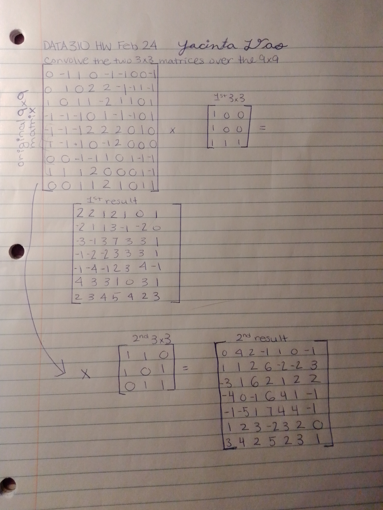

### Convolutions Exercise
#### Convolve the two 3x3 matrices that were assigned to you with your 9x9 matrix and calculate the resulting two matrices

#### What is the purpose of using a 3x3 filter to convolve across a 2D image matrix?
#### Applying a filter to image can be helpful for extracting features. For example, the filter may emphasize and/or deemphasize parts of the image. The way it accomplishes this in python is by applying a matrix (in this case sized 3x3) over a 2D matrix that represents the image. 
#### We could include more than one filter because different filters serve different purposes. For example, one filter may emphasize horziontal lines whereas another filter may emphasize vertical lines. Alternatively, a filter could darken the image versus lighten it. 
#### I tried three different filters on the mnist dataset but only applied one at a time.
