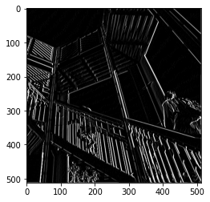
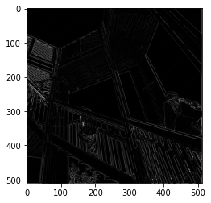
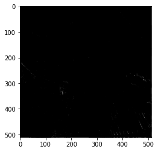
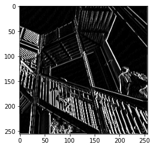
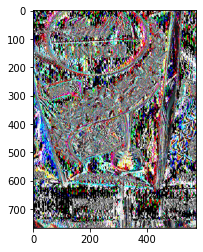
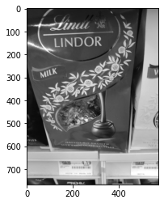

#### Question 1: Last time you did an exercise (convolutions and pooling) where you manually applied a 3x3 array as a filter to an image of two people ascending an outdoor staircase. Modify the existing filter and if needed the associated weight in order to apply your new filters to the image 3 times. Plot each result, upload them to your response, and describe how each filter transformed the existing image as it convolved through the original array and reduced the object size. 

#### The first image was created by applying the existing filter. filter = [ [-1, -2, -1], [0, 0, 0], [1, 2, 1]] This filter did a good job of emphasizing vertical lines. The next three filter will be my own; by playing around with the filters, I will get a better idea of how I can manipulate an image for computer vision.

#### This image was created by applying the filter = [ [0, 1, 0], [1, -4, 1], [0, 1, 0]]. It appears to make the image much darker. I wonder if that is because the number applied to the current pixel is -4. I am curious to see what happens if I increase or decrease the number in that position.

#### This image was created by applying the filter = [ [0, 1, 0], [1, -8, 1], [0, 1, 0]]. It is extremely dark; this must have been caused by the change from -4 in its position to -8. I am curious to see what happens when the number in that middle position [1,1] is increased.

#### This image was created by applying the filter = [ [0, 1, 0], [1, 4, 1], [0, 1, 0]]. It is clearly much lighter than the other filtered images. I conclude that increasing the number in the position [1,1] makes the image lighter while decreasing it darkens the image. 

#### Question 2: What are you functionally accomplishing as you apply the filter to your original array (see the following snippet for reference)? Why is the application of a convolving filter to an image useful for computer vision? 

#### The filter is assigning each current pixel a new value. It does this by multiplying all adjacent pixels and the current pixel by the corresponding value in the 3x3 array and summing them. The sum then gets multiplied by a weight which may function to normalize the value of the pixel. If this value is less than 0, it is set to be equal to 0 which I am assuming would be white. If the value is greater than 255, it is set to be equal to 255 which I am assuming would be black. The applicaiton of a convolving filter to an image is useful for computer vision because it can emphasize certain features of the image, making it easier for the computer to recognize key characteristics. For example, the default filter emphasized vertical lines, making it more obvious that the picture was of a staircase and walkway. 

#### Question 3: Another useful method is pooling. Apply a 2x2 filter to one of your convolved images, and plot the result. In effect what have you accomplished by applying this filter? Does there seem to be a logic (i.e. maximizing, averaging or minimizing values?) associated with the pooling filter provided in the example exercise (convolutions & pooling)? Did the resulting image increase in size or decrease? Why would this method be useful?

#### By applying this filter, I have condensed the image to a quarter of its original size while preserving important features. This is helpful because it is smaller and there is less for a computer to process; however, the important information is still present. The logic of this filter is that it skips every other pixel. This seems to be a random method of pooling the image; it is not the same as maximizing, minimizing, or averaging. 

#### Stretch goal: instead of using the misc.ascent() image from scipy, can you apply three filters and weights to your own selected image? Again describe the results. Again, instead of using misc.ascent(), apply the pooling filter to one of your transformed images.

#### This is an image of my favorite sweet. I will be applying filters to it.

#### This is the image after applying the default convolving filter from the exercise.  filter = [ [-1, -2, -1], [0, 0, 0], [1, 2, 1]] 

#### I decided to grayscale the image before applying more filters.

#### This is my image after applying filter = [ [2, 2, 2], [1, 1, 1], [0, 0, 1]]. It does not look that different. I wonder if it would be changed more if there were a few large values. 

#### This is my image after applying filter = [ [8, 0, 0], [1, 0, 1], [0, 0, 0]]. It also does not look different.
