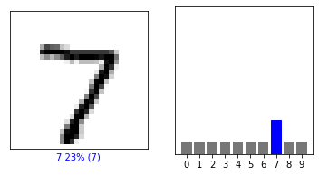

#### 4. Estimate a probability model and apply it to the test set in order to produce the array of probabilities that a randomly selected image is each of the possible numeric outcomes (look towards the end of the basic image classification exercises for how to do this - you can apply the same method applied to the Fashion MNIST dataset but now apply it to the hand written letters MNIST dataset.)
#### probability_model = tf.keras.Sequential([model, tf.keras.layers.Softmax()])
#### predictions = probability_model.predict(test_images)
#### 5. Use np.argmax() with your predictions object to return the numeral with the highest probability from the test labels dataset. 
#### For the index of 0, I got the numeral 7.
#### 6. Produce a plot of your selected image and the accompanying histogram that illustrates the probability of that image being the selected number. 

