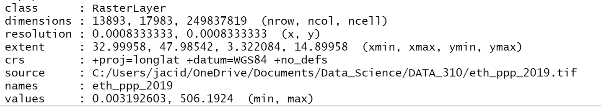
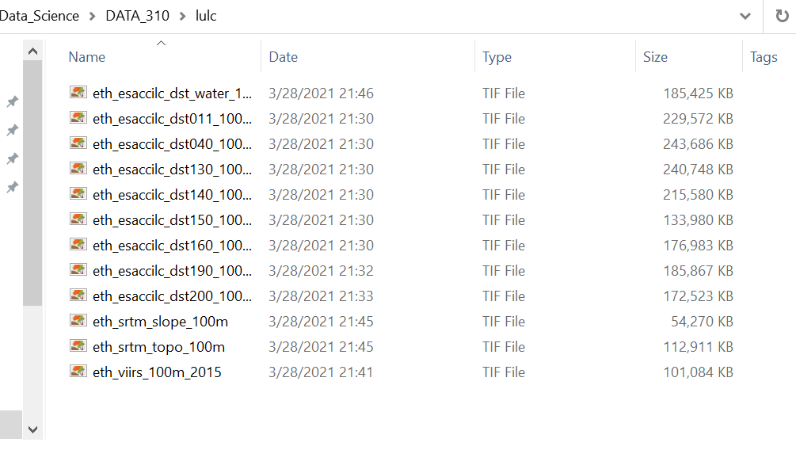

#### Download the administrative subdivision. Below is a plot of my country, Ethiopia, using the admin data.

#### Download the population raster from Worldpop.

#### Download the 12 rasters and stack them. I have downloaded them. However, I am having some technical difficulties proceeding.
 
#### Produce a raster stack and calculate summary stats using the script posted to our slack channel.
