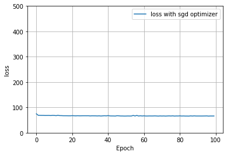
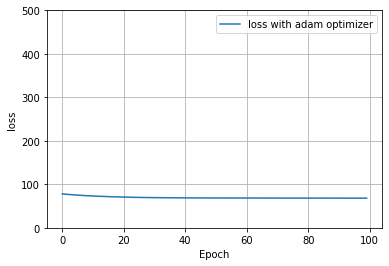
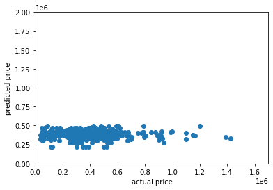
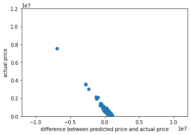

#### Project 1
#### **Task #1: Pick a city, scrape as many observations from Zillow**
#### I chose to examine **Madison**, the capital of Wisconsin. I first scraped exactly **400 observations**, generating a comma separated values (.csv) file which I named homes.csv. To understand the data a little bit better, I looked at some basic stats.

| | Beds | Bathrooms | Square Footage | Price |
| ---- | ---- | ---- | ---- | ---- |
| Mean | 2.99 | 2.29 | 1814.95 | 467777.33 |
| 1Q | 2 | 2 | 1221 | 259900 |
| Median | 3 | 2 | 1544 | 350000 | 
| 3Q | 4 | 3 | 2036.5 | 487550 |
| Max | 6 | 5 | 5330 | 12999000 | 
| Min | 1 | 1 | 45 | 37000 |

#### There is a wide range of house prices in the dataset. The mean house price is greater than the median; there are likely some expensive outliers that skew this mean above the median. The mean and median of the number of bedrooms are approximately equal, indicating that the data is fairly symetric with respect to this variable. The mean and median for number of bathrooms are also close together. There is a decent sized disparity between the mean and median for square footage; the mean is greater by 300, which means there are probably some larger homes skewing the data. 
#### I imported homes.csv into a PythonProject that uses Python 3.8 because in my next steps I will be using the tensorflow library, which runs best in this Python version. However, before applying a machine learning model, it is necessary to clean the data.

#### **Task #2: Clean the housing data you obtained and create a number of usable features and targets.**
#### After importing the data into my project using the Python 3.8 interpreter, I opened it to read through, looking for potential issues. I saw a few en dashes spaced throughout and decided that I would replace these en dashes with a value of zero for my model. I chose to replace the missing data with values of zero. Although this is not the most accurate approach, because there were not many missing values, I posited that it would not make a big difference in the overall performance of the model. I then removed html tags.
#### I created new vectors for each variable of interest. Beds, number of bedrooms, square footage are my features and predictors of house price. X1 is number of bedrooms, X2 is number of bathrooms, X3 is square footage, and X4 is zip code. I created a column in the data frame for the zip code associated with each home bt splitting the string of the address after the state because zip code is always listed after state. I set price as the response variable and target. I converted all this information to the float data type. 
#### I then normalized my data by dividing my x3, which represents square footage, by 1000 and y, house prices, by 100000. One of my reasons for creating columns separate from the dataframe was so I could normalize without changing any values in the dataframe. Now the data should be ready to input into a model.

#### **Task #3: Train a model on your target and features.**
#### I created a Sequential model with one dense layer that takes an input shape equal to 4. I compiled my model with a stochastic gradient descent optimizer and a loss function using mean squared error. Mean squared error is the sum of the squared difference between the actual value and predicted value divided by the total number of points n. 
#### I then stacked my features, x values x1, x2, x3, x4, and fit the model to my features and target. I used ten epochs because I wanted to see if it would run before committing to a larger epoch size and longer runtime. The model generated a loss equal to Nan, and when I created a column y_pred for model predictions, all y_pred values equaled Nan. 
#### I decided to go back and remove my variable for zip code to see if my model would work without it. I repeated all the steps, except gave the model an input shape of 3 instead of 4, and only stacked x1, x2, and x3 (excluding zip code). The model worked and generated y_pred values that made sense. I decided to continue working on my project without the zip code variable; I will incorporate it later if/when I have the time.  
#### After seeing that the model ran on the data without the zip code variable, I decided to run the model again but with 100 epochs. However, my model did not improve much with increasing epochs, as shown below.

#### I decided to try out a different optimizer to see if it would be better at reducing loss. I compiled the model with an adam optimizer. Because it does not appear that the adam optimizer is significantly better than sgd for this data, I will continue on using my original model (with the sgd optimizer) to conform with the expectations for the lab.

#### I used the model to make predictions for each house price in the dataset. I added a column for predictions to the dataframe, as well as a column for the difference between predicted price and actual price. Below is a plot of the actual prices versus the predicted precies. It seems that the model was not very accurate at predicting, especially for the more expensive homes and the least expensive. The model seemed best able to predict homes that lay in the range of the mean and median (around 350-500k). Nearly all of the predicted house prices fall within the range of 300k and 600k, which is a much narrower range than the range of actual house prices (37k - 13 million). Clearly, the model is inaccurate for predicting homes that cost less than 250k and more than 500k because there are few if any predictions under or above despite being houses that cost less than 250k and more than 500k.; these numbers correspond, respectively, to about the 1st and 3rd quartiles of the house prices. 

#### Below is a plot of the absolute value of the difference between predicted and actual house price and actual house price. The points appear similar to an upward facing parabola; points in the middle are closest to an absolute difference of zero, corroborating the hypothesis that the model best predicted the cost of homes in the middle of the price range. It looks like the model was poorest at predicting of the cost of more expensive homes; as house price increases, the difference between actual and predicted price increases as well. The model did not accurately predict the cost of the least expensive homes as well as it predicted homes in the middle of the price range. 

#### The table below includes statistics for the difference between predicted and actual price, predicted price, and actual price for comparison. It is interesting to note the narrow range of predicted prices. All predicted prices are between 300k and 570k. The range of actual prices is much larger. The mean of predicted house prices is similar to but slightly less than the mean of actual house prices, and the median of predicted house prices about 100k greater the median of actual house prices. The numbers from this table further prove the point that this model works best on data that falls in the interquartile range of the actual house prices. The model is not accurate for outliers. 

| | Difference | Predicted Price | Actual Price | 
| ---- | ---- | ---- | ---- |
| Min | -12514578.84 | 306950.52 | 37000 |
| Max | 515548.8 | 562248.80 | 12999000 |
| Mean | -28258.32 | 439519.01 | 467777.33 |
| 1Q | -42606 | 421895.6 | 259900.0 |
| Median | 78020 | 440404.51 | 350000 |
| 3Q | 191739.82 | 465606.93 | 487550 |

#### **Task #4: Rank all homes from best to worst deal**
#### Because this model is skewed to better predict houses in the middle range for house prices, by its parameters, the cheapest houses are the best deals because they are consistently over-predicted by the model and the most expensive houses are the worst deals because they are under-predicted by the model. Below is a plot of difference between actual and predicted price and the actual price. The greater the difference, the better the deal; that is the houses are ranked from left to right as worst to best.

#### The worst deal is the most expensive house in the dataset, 5209 Harbor Ct, costing nearly $13 million. The model predicted its price to be $484k, putting the difference at around $12.5 million. This house has 3 bedrooms, which is half the number of bedrooms as the house(s) with the most bedrooms (6). The square footage of this house is nearly 3000; however, this is much less than the max square footage of the dataset (5330). This house is clearly a bad deal. 
#### The best deal is one of the cheaper houses in the dataset, 2407 Dunns Marsh Ter. This house costs 46700 but the model values it at 562249, putting the difference at over half a million dollars greater than its actual cost. This house has 3 bedrooms, which is average for the dataset, and 
