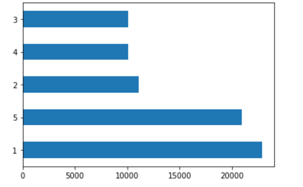
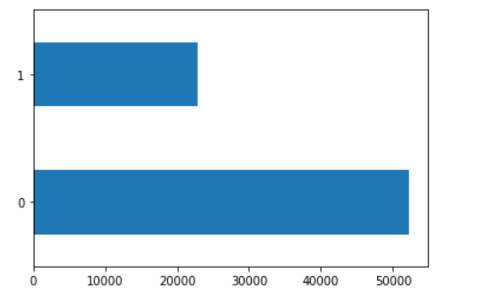
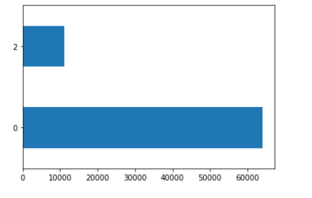
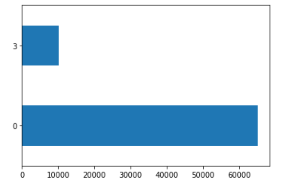
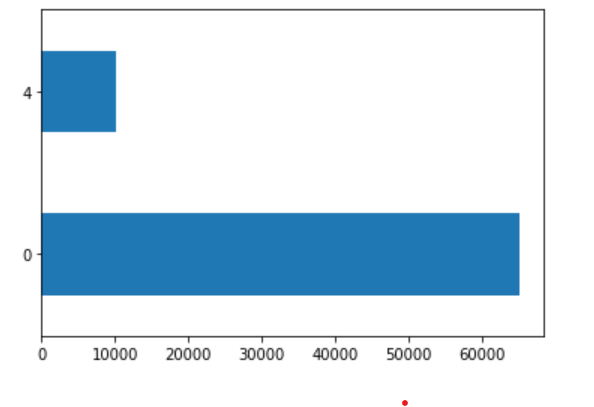
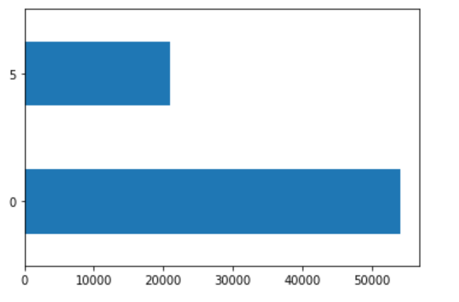
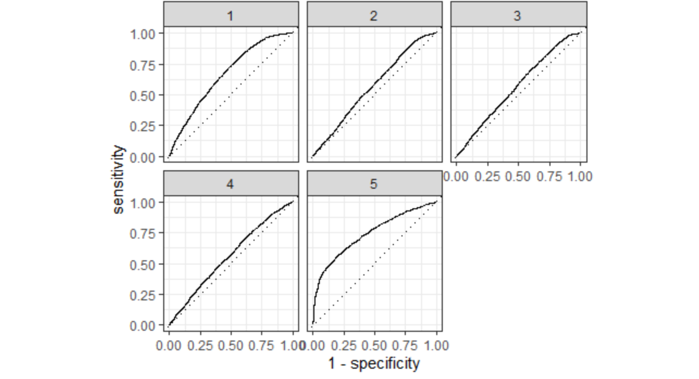
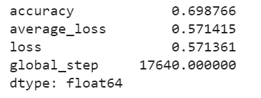

### Project 2

#### Introduction: For this project, I will use DHS data to create models for predicting wealth in Ethiopia based on age, gender, education level, household size. This DHS data is Ethiopia's household recode from the year 2016, and it is a Standard DHS-VII survey. I will create a penalized logistic regression model, a random forest model, another logistic regression model using the tensorflow estimator API, and a gradient boosting model using decision trees. I will choose the best model from each of this based on available parameters as well as the best model overall using AUC-ROC curves.
#### There are approximately 75,000 people sampled in this dataset. I have included following plots to get a better sense of the wealth distribution among the sample. The first plot (below) shows how many people are in each of the five wealth categories.

#### For the next five plots, I plotted only one wealth category population against all the others. The first plot is the least wealthy group (1) versus all the others.

#### The second plot is the second least wealth group (2) versus all others.

#### The third plot is the middle group (3) versus all others.

#### The fourth plot is the second most wealthy group (4) versus all others.

#### The fifth plot is the most wealthy group (5) versus all others.

#### The largest wealth categories, based on population, are the least wealthy (1) and most wealthy (5). Perhaps this is why previous models have been best at predicting for these two groups.
 
#### Task #1: Using the R script provided, split and sample your DHS persons data and evaluate the AUC - ROC values you produce. 
#### Which "top_model" performed the best (had the largest AUC)? Are you able to use the feature selection penalty to tune your hyperparameter and remove any potentially irrelevant predictors? 

#### Based on this data alone, it is difficult to select the best performing model because the mean accuracy of several top models is the same. I will plot the models'AUC-ROC curves to see which is the biggest, and then select that penalty to tune my hyperparameter and remove any potentially irrelevant predictors.
#### Provide justification for your selected penalty value? Finally, provide your ROC plots and interpret them. How effective is your penalized logistic regression model at predicting each of the five wealth outcomes.

#### I chose the penalty from the eleventh slice because it has the highest penalty without decreasing model performance. Although the decrease in model performance is not very great for the twelfth through the fourteenth slices, the eleventh slice had the highest area under the ROC curve of all slices, and it is more penalized compared with the previous ten slices, so I will select its penalty. This penalty equals .00108. I think this slice best balances area under the curve and penalty; it has a large area and a decent penalty. The plot below shows how well this slice predicts each of the five wealth outcomes. 

#### The slice clearly predicts the wealthiest population the best. It also predicts the least wealthy group decently well. It is not as accurate for the middle three groups. With more time, I would like to combine the middle three groups into one large group to see how it would affect the model. 
#### For comparison, I have chosen the twelfth slice, with a penalty of .00137. The twelfth slice has a higher penalty, so it may be better at removing potentially irrelevant predictors. However, there is slightly less area under the ROC curve, so it may not be as good at predicting wealth outcomes.

#### This slice is also best at predicting the wealthiest group and second best at predicting the least wealthy group. It does not appear to be significantly different from the best model, which makes sense because the AUC-ROC and penalty values are very close.
#### Using the R script provided, set up your random forest model and produce the AUC - ROC values for the randomly selected predictors, and the minimal node size, again with wealth as the target. 
#### How did your random forest model fare when compared to the penalized logistic regression? Provide your ROC plots and interpret them. Are you able to provide a plot that supports the relative importance of each feature's contribution towards the predictive power of your random forest ensemble model?

#### Using the python script provided, train a logistic regression model using the tensorflow estimator API and your DHS data, again with wealth as the target. 
#### Apply the linear classifier to the feature columns and determine the accuracy, AUC and other evaluative metrics towards each of the different wealth outcomes. 
#### Below is my first plot of predicted probabilities against frequency using size, education, age, and gender as predictors of wealth.

#### Then continue with your linear classifier adding the derived feature columns you have selected in order to extend capturing combinations of correlations (instead of learning on single model weights for each outcome). 

#### Again produce your ROC curves and interpret the results.

#### Using the python script provided, train a gradient boosting model using decision trees with the tensorflow estimator. 
#### Provide evaluative metrics including a measure of accuracy and AUC. Produce the predicted probabilities plot as well as the ROC curve for each wealth outcome and interpret these results.

#### Analyze all four models. According to the evaluation metrics, which model produced the best results? Were there any discrepancies among the five wealth outcomes from your DHS survey dataset?
