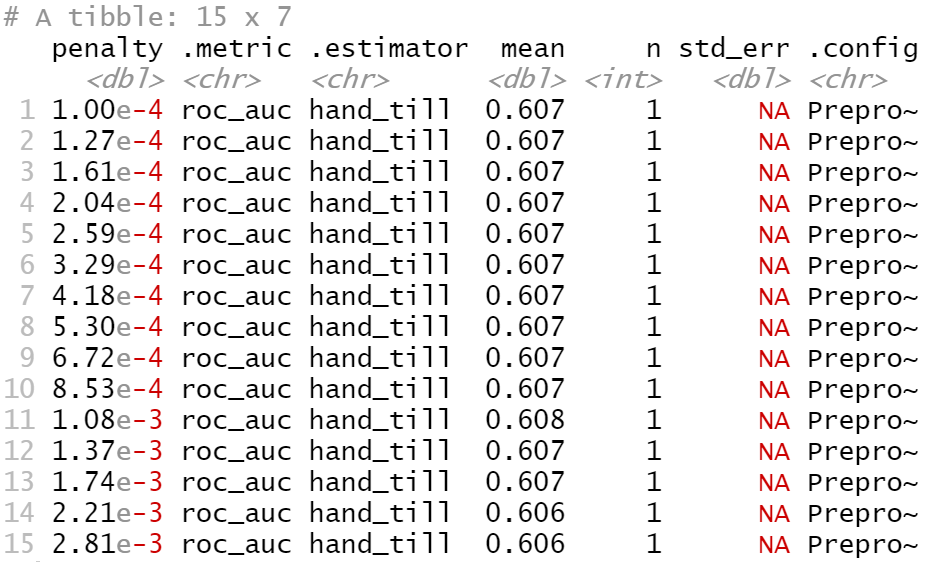
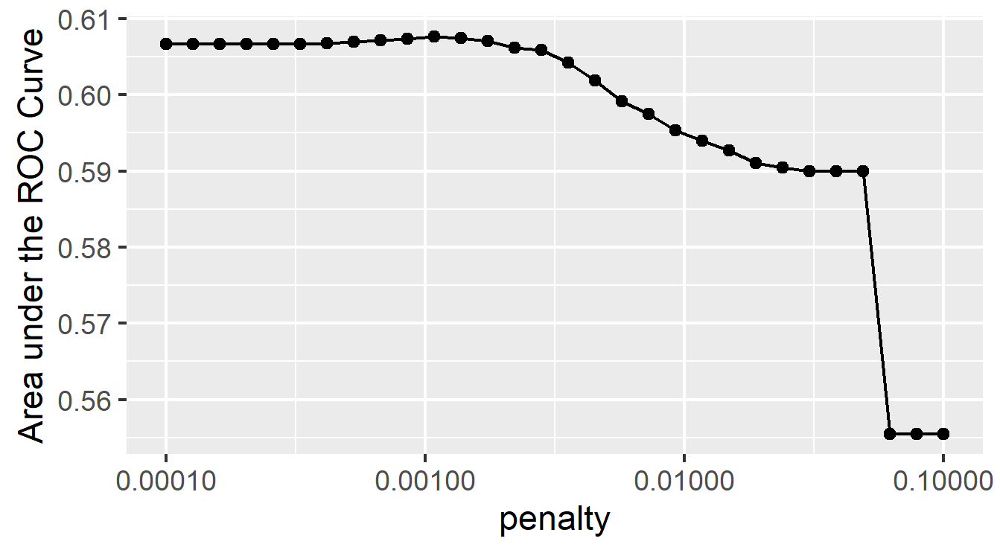
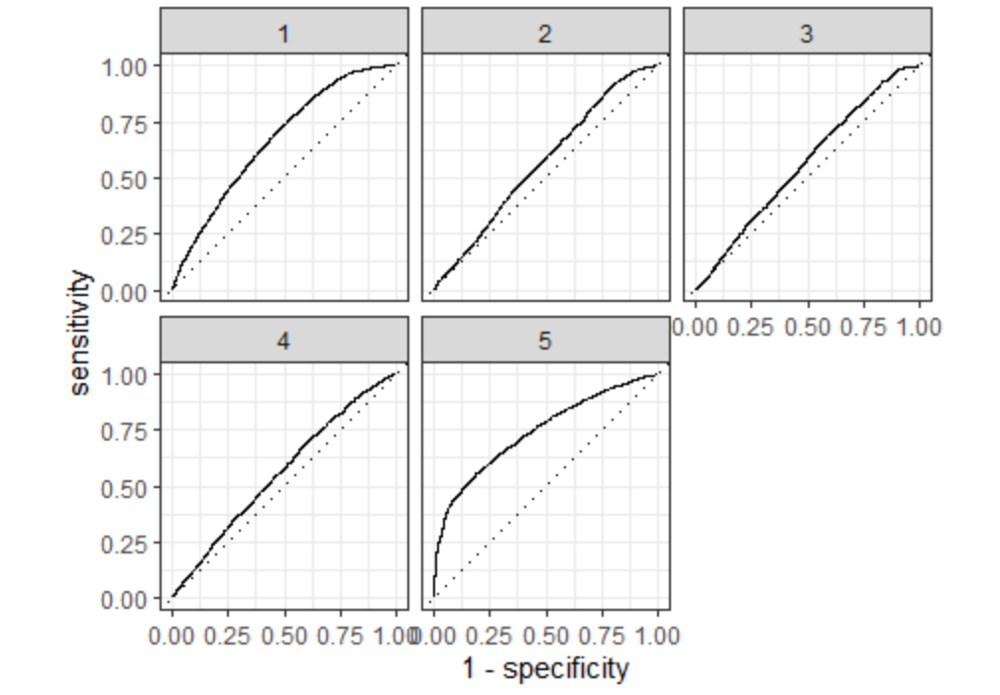

### Project 2

#### Introduction: For this project, I will use DHS data to create models for predicting wealth in Ethiopia based on age, gender, education level, household size. I will create a logistic regression model, a random forest model, a linear regression model, and a gradient boosting model using decision trees. I will choose the best model from each of this based on available parameters as well as the best model overall using AUC-ROC curves.
#### Task #1: Using the R script provided, split and sample your DHS persons data and evaluate the AUC - ROC values you produce. 
#### Which "top_model" performed the best (had the largest AUC)? Are you able to use the feature selection penalty to tune your hyperparameter and remove any potentially irrelevant predictors? 

#### Based on this data alone, it is difficult to select the best performing model. I will plot the models'AUC-ROC curves to see which is the biggest, and then select that penalty to tune my hyperparameter and remove any potentially irrelevant predictors.
#### Provide justification for your selected penalty value? Finally, provide your ROC plots and interpret them. How effective is your penalized logistic regression model at predicting each of the five wealth outcomes.

#### The eleventh model had the highest area under the ROC curve, so I will select its penalty. This penalty equals .00108. The plot below shows how well this model predicts each of the five wealth outcomes. 

#### The model clearly predicts the wealthiest population the best. It also predicts the least wealthy group decently well. It is not as accurate for the middle three groups. With more time, I would like to combine the middle three groups into one large group to see how it would affect the model. 
#### For comparison, I have chosen to slice the second best model by area under the ROC curve.
#### Using the R script provided, set up your random forest model and produce the AUC - ROC values for the randomly selected predictors, and the minimal node size, again with wealth as the target. 
#### How did your random forest model fare when compared to the penalized logistic regression? Provide your ROC plots and interpret them. Are you able to provide a plot that supports the relative importance of each feature's contribution towards the predictive power of your random forest ensemble model?

#### Using the python script provided, train a logistic regression model using the tensorflow estimator API and your DHS data, again with wealth as the target. 
#### Apply the linear classifier to the feature columns and determine the accuracy, AUC and other evaluative metrics towards each of the different wealth outcomes. 
#### Then continue with your linear classifier adding the derived feature columns you have selected in order to extend capturing combinations of correlations (instead of learning on single model weights for each outcome). 
#### Again produce your ROC curves and interpret the results.

#### Using the python script provided, train a gradient boosting model using decision trees with the tensorflow estimator. 
#### Provide evaluative metrics including a measure of accuracy and AUC. Produce the predicted probabilities plot as well as the ROC curve for each wealth outcome and interpret these results.

#### Analyze all four models. According to the evaluation metrics, which model produced the best results? Were there any discrepancies among the five wealth outcomes from your DHS survey dataset?
