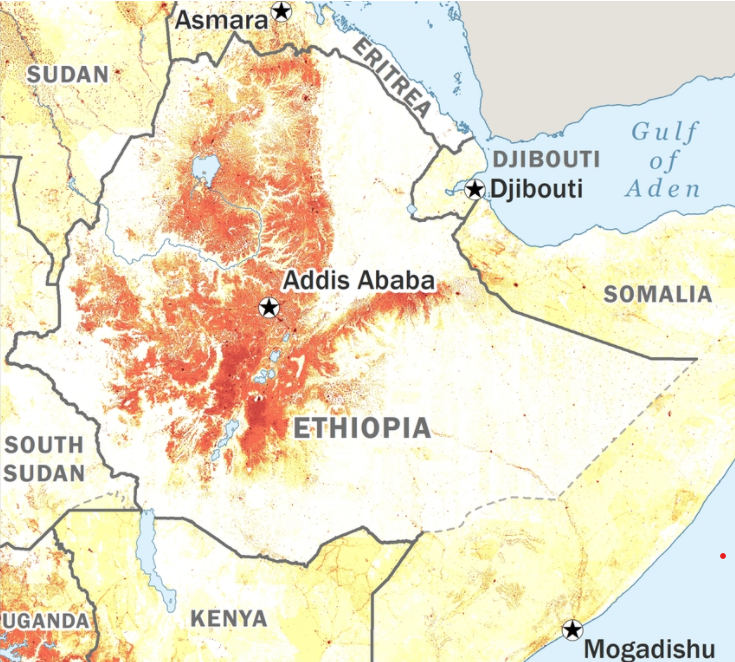
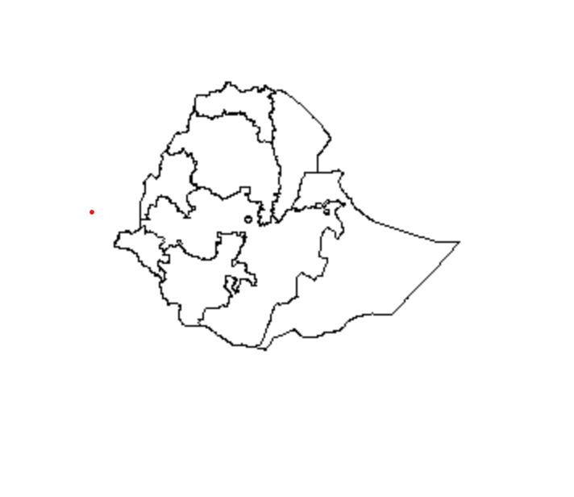
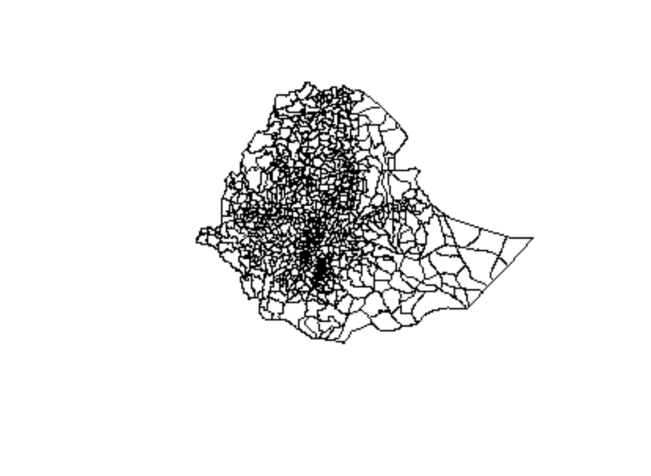

### Project 3
##### Selected Country: Ethiopia 
##### I chose to work with Ethiopia because I had worked with Ethiopia for Project 2 and wanted to learn more about the country. Ethiopia is a currently landlocked country  country located on the Horn of Africa. I chose the word "currently" to describe its landlocked nature because throughout its history its geographic boundaries have changed, and at points it did include territory adjacent to the Red Sea. However, it has been landlocked 1993. Ethiopia's boundaries, which have changed over time may present a challenge for geospatial analysis. Ethiopia is a fairly large and populated country, with over one million total square kilometers of land and over 110 million people; I discovered this when my computer was unable to process all its data due to the sheer size. Ethiopia contains nearly 8k square kilometers of water. The country's average elevation is about 1330m. The greatest use of land is for agriculture; nearly 40% of the land is used for agricultural purposes. Another 20% serves as pastures. Ethiopia borders Djibouti, Eritrea, Kenya, Somalia, South Sudan and Sudan. It is possible that population counts for Ethiopia may be affected by internal conflict or conflict in bordering countries. 
##### Most of Ethiopia's populations is concentrated in the northern and central parts of the country, particularly around the capital Addis Ababa. The following map from the CIA World Factbook provides a means of visualizing population density in Ethiopia.

#### Below is a graphic of Ethiopia at the level of the primary administrative division.

#### Below is a graphic of Ethiopia at the level of third-order administrative division.

##### I intended to use complete raster data with 100x100m resolution for the whole country for the project. However, I ran into difficulties related to the size of the data, so I decided to study a subdivision. I chose to focus on the region Afar, located in the northeastern Ethiopia. Below is a map of Ethiopia provided by CARE, a humanitarian organization, that highlights afar (in light orange), shows its relation to the capital, and lists some interesting facts about it.
##### Using two machine learning methods, predict population values at 100 x 100 meter resolution throughout your selected country. I chose to apply a simple linear model as well as a random forest model.
#### Validate the two models using different methods presented in this class. 
#### Write a report assessing the two approaches and which of the two models was more accurate.
#### Be sure to account for spatial variation throughout your selected location and provide substantive explanations for why those variations occurred.
