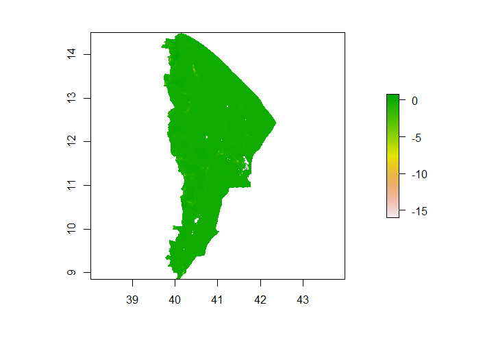

### Project 3
##### Selected Country: Ethiopia 
##### I chose to work with Ethiopia because I had worked with Ethiopia for Project 2 and wanted to learn more about the country. Ethiopia is a currently landlocked country located on the Horn of Africa. I chose the word "currently" to describe its landlocked nature because throughout its history its geographic boundaries have changed, and at points it did include territory adjacent to the Red Sea. However, it has been landlocked 1993. Ethiopia's boundaries, which have changed over time may present a challenge for geospatial analysis. Ethiopia is a fairly large and populated country, with over one million total square kilometers of land and over 110 million people; I discovered this when my computer was unable to process all its data due to the sheer size. Ethiopia contains nearly 8k square kilometers of water. The country's average elevation is about 1330m. The greatest use of land is for agriculture; nearly 40% of the land is used for agricultural purposes. Another 20% serves as pastures. Ethiopia borders Djibouti, Eritrea, Kenya, Somalia, South Sudan and Sudan. It is possible that population counts for Ethiopia may be affected by internal conflict or conflict in bordering countries. 
##### Most of Ethiopia's populations is concentrated in the northern and central parts of the country, particularly around the capital Addis Ababa. The following map from the CIA World Factbook provides a means of visualizing population density in Ethiopia.

##### Below is a graphic of Ethiopia at the level of the primary administrative division.

##### Below is a graphic of Ethiopia at the level of third-order administrative division.

##### I intended to use complete raster data with 100x100m resolution for the whole country for the project. However, I ran into difficulties related to the size of the data, so I decided to study a subdivision. I chose to focus on the region Afar, located in the northeastern Ethiopia. Below is a map of Ethiopia provided by CARE, a humanitarian organization, that highlights Afar (in light orange), shows its relation to the capital, and lists some interesting facts about it.

##### Below is a graphic showing Afar and the subdivisions within Afar.

##### Using two machine learning methods, predict population values at 100 x 100 meter resolution throughout your selected country. I chose to apply a simple linear model as well as a random forest model.
##### Model 1) Linear model
##### To run the linear model, I modeled predictions using geographic coordinates and the sum of all the variables (water, dst011, dst040, dst130, dst140, dst150, dst160, dst190, dst200, topo, slope, ntl). 

##### Below is the plot of population sums generated by the linear model. 

##### I decided to compare that with a map of Afar demonstrating population density to ensure that my methodology and filtering were correct, and it appears that they match up.

##### Although the Afar region is not known for any urban ongoings, it does appear that there is a higher population density towards the northwest. I will keep this in mind when analyzing model performance.

##### Below is a plot showing the difference between the actual population sums and those predicted by the model. It appears that the model has slightly underpredicted the population. The plot does show that the model fairly consistently underpredicted across the region, meaning that the error was with the model itself and not a result of regional differences within Afar.  

#### Below is a 3D visualization demonstrating the predictions versus actual population counts. There is a consistent clustering of lines below the model, demonstrating consistent under predictions of the model thorughout the region. Most of the population are pastoralists, some of whom are nomadic, so it is possible that the lack of urbanization and prominent city centers in the region causes this phenomenon of consistent underprediction. 

##### Below is a 3D visualization of root mean squared error of the model across the region.

##### When I first ran the model, I encountered the following issue: The sum of the population sums from the model equals 1809074. The sum of the population is 101017113, which is quite a bit bigger. It seems like model is severely underpredicting the population counts, but I do not think this is the case. I think the reason for this great disparity is because the predicted sum is only for the Afar region but the actual sum includes all of Ethiopia. According to Google, the Afar region has approximately 1.8 million residents, meaning the model is not far from its mark. 
##### However, upon running it again and filtering for Afar properly, I found that the model predicted a total subdivision population of 1783250.. The actual population according to eth_ppp_2019, when filtered correctly, equals 1783304. These numbers are not very far apart, indicating that the model is fairly good at predicting the total population of Afar. However, upon looking at the total error for the model, as defined by the absolute value of the sum of all the differences between actual and predicted population counts, the model was not very successful predicting populations at a more local level within Afar. The sum of the errors that are the differences between predictions and actual populations equals 1497986, which is fairly large. Overall, the model is both useful and consistent. However, there is room for improvement. 

##### Model 2) Random Forest Model
##### I used a random forest regression model with 500 trees that predicted the population using the same variables as the regression model (sum of water, dst011, dst040, dst130, dst140, dst150, dst160, dst190, dst200, topo, slope, ntl). The R^2 for the model is 82.39, which is fairly high for a real-world model, although it could realistically be improved further. 

##### Below is a plot showing how error changes with the number of trees in the model.

##### It may be worth creating a random forest model with less trees because it does not seem that having 500 trees is significantly better than having any number more than 200.
##### Below is a plot showing the usefulness of each variable based on inc node purity. It may also be worth creating another model without the less useful variables such as dst200 and dst130. With more time, I would ideally incorporate means of variables as well as the sums.

##### Below is the plot of population sums generated by the random forest model. 

##### Below is a plot of the difference between the model predictions and actual population values.

##### Based on the shade of green, which is close if not identical to that which matches up with the zero marker in the color key, this model has performed better than the linear model. Although it still seems to underpredict population slightly, it does not underpredict as much as the linear model.
##### The model validation technique used is absolute error; that is, the difference between the predictions and the actual values. This can be visualized using the plots of the differences between the predictions and values, shown above. These plots are slightly different shades of greens, indicating slightly different levels of under prediction. In the cases of both the models, the plots are fairly consistent in the amount that they underpredict; this is likely because Afar does not have any large cities. Despite a regional population of nearly 2 million, the largest city in Afar has only one hundred thousand people. Afar does not possess major urban centers that would skew the model; most of the land is used for agricultural purposes, and most of the Afar people are pastoralists. 
##### The random forests model underpredicted less than the linear model. Based on its high R^2 value and the plot of the differences between actual and predicted population sums, I would argue that the random forests model is the better of the two. It is likely that selecting variables more carefully and changing the number of trees used could further ipmprove the model as well. 

##### References:
https://www.careinternational.org.uk/transforming-lives-afar-region-ethiopia
https://www.britannica.com/place/Ethiopia
https://www.cia.gov/the-world-factbook/countries/ethiopia/#geography
http://www.ethiodemographyandhealth.org/Afar.html
