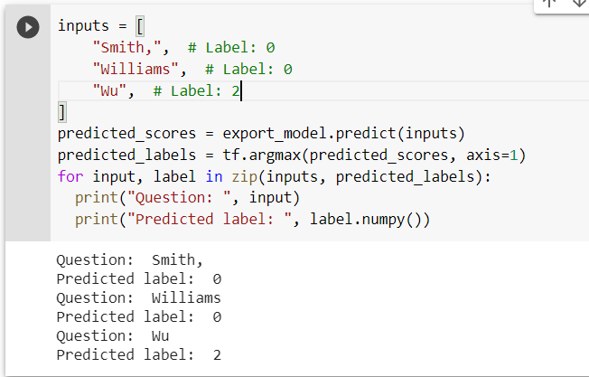

### Applying an RNN to Classify Names According to Ethnicity: Final Project Abstract

#### Problem Statement
#### There are plenty of datasets such as administrative records which could be useful for demographic research - however, many lack specific ethnicity information for certain groups or ethnicity records altogether. For example, in many administrative records, people of Arab descent are classified as "white." Although this is technically an ethnic classification, it is ambiguous and it proves to be an obstacle to scholars wishing to use these records to study Arab populations. The problem statement for this research project is how leverage machine learning techniques to classify names according to the appropriate ethnicity (with groupings and specificity levels corresponding to that of the training set). 
#### This problem was inspired by Professor Bakhtiari medical sociology research in William & Mary's sociology department, which I work on as a research assistant focused on the computational side of things. In my capacity as a research assistant, I have applied a Naive Bayes classifier and Long Short Term Memory model to classify names. For this project, I decided I wanted to apply a different method to see if it would work and if it could improve upon the previous two. 

#### Description of the data
#### I am using a dataset which includes 148,275 names scraped from Wikipedia and the race or ethnicity associated with each name. There are three variables for each observation in the dataset: first name, last name, and race/ethnicity classification. This dataset was collected by Steven Skiena’s research team with the same end goal of building a name classifier. The classes of race/ethnicity are: ‘GreaterEuropean,WestEuropean,Germanic’, ‘GreaterAfrican,Muslim’, ‘GreaterEuropean,WestEuropean,Nordic’, ‘GreaterEuropean,WestEuropean,Hispanic’, ‘GreaterEuropean,Jewish’,’GreaterAfrican,Africans’, ‘Asian,GreaterEastAsian,Japanese’, ‘GreaterEuropean,WestEuropean,French’,’GreaterEuropean,EastEuropean’, ‘GreaterEuropean,British’,’Asian,GreaterEastAsian,EastAsian’, ‘Asian,IndianSubContinent’,’GreaterEuropean,WestEuropean,Italian’. I have condensed all these classifications to three classes: Asian, European, and African. These larger groups include all the smaller ethnic groups within; for example, European includes everything with "GreaterEuropean" and Asian includes everything with "Asian." I thought it would be simpler for the model to classify names that were Asian, European, or African.

#### Specification for the applied machine learning model
#### I decided to base my model on an example of an RNN from TensorFlow.org for application to texts. The model is a sequential model with an embedding layer, a one-dimensional convolutional layer, a global max pooling layer, and a dense layer. The model uses a binary cross-entropy loss function and an adam optimizer.

#### Assessment of model performance
#### The model performed incredibly well. After three epochs, the accuracy was 91.72%.
#### Moreover, upon exporting the model and using it to predict example last names such as "Smith" (European) and "Wu", the model performed correctly every time. 

#### Ultimately, this model was a success. I am excited to see how it can fit into the grand scheme of the research project classifying names of Americans of Arab descent to study population level health outcomes.
